  

<!-- Title -->
<h3 align="center">
    <samp>
        &gt; Hey There!, I am
        <b><a target="_blank" href="https://www.linkedin.com/in/hirad-alagha/">Hirad Emamialagha</a></b>
    </samp>
</h3>

 

<samp>
「 Lead ML Engineer building scalable AI systems, MLOps platforms, and distributed ML infrastructure 」  
</samp>

  

<!-- Title -->

  

  

  

# 🛠 Technologies & Projects

<h1 align="left">🛠 Technologies & Projects</h1>

<table width="100%" border="0" cellspacing="0" cellpadding="0">
<tr>

<!-- LEFT -->
<td width="50%" valign="top" align="center">

<h3>🛠 Technologies</h3>

<table align="center" cellspacing="0" cellpadding="6">
  <tr>
    <td align="center"></td>
    <td align="center"></td>
    <td align="center"></td>
    <td align="center"></td>
    <td align="center"></td>
  </tr>
  <tr>
    <td align="center"></td>
    <td align="center"></td>
    <td align="center"></td>
    <td align="center"></td>
    <td align="center"></td>
  </tr>
  <tr>
    <td align="center"></td>
    <td align="center"></td>
    <td align="center"></td>
    <td align="center"></td>
    <td align="center"></td>
  </tr>
  <tr>
    <td align="center"></td>
    <td align="center"></td>
    <td align="center"></td>
    <td align="center"></td>
    <td align="center"></td>
  </tr>
  <tr>
    <td align="center"></td>
    <td align="center"></td>
    <td align="center"></td>
    <td align="center"></td>
    <td align="center"></td>
  </tr>
</table>

</td>

<!-- RIGHT -->
<td width="50%" valign="top" align="center">

<h3>🧪 Highlighted Projects</h3>

<table width="100%" cellspacing="0" cellpadding="10">

<tr>
<td align="center">

</td>
</tr>

<tr>
<td align="center">

</td>
</tr>

<tr>
<td align="center">

</td>
</tr>

<tr>
<td align="center">

</td>
</tr>

<tr>
<td align="center">

</td>
</tr>

<tr>
<td align="center">

</td>
</tr>

</table>

</td>

</tr>
</table>

# 🐍 Contribution Journey

  

### 📊 Vital Statistics

  

  

    

  

# 🤝 Collaboration

I’m open to collaborating on:

- ML infrastructure projects
- Reinforcement learning systems
- Robotics & autonomous systems
- Large-scale AI platforms

# 📫 Contact

 

 

⚡ Building scalable AI systems and machine learning infrastructure

Star ⭐ the repos if they helped you!

  

