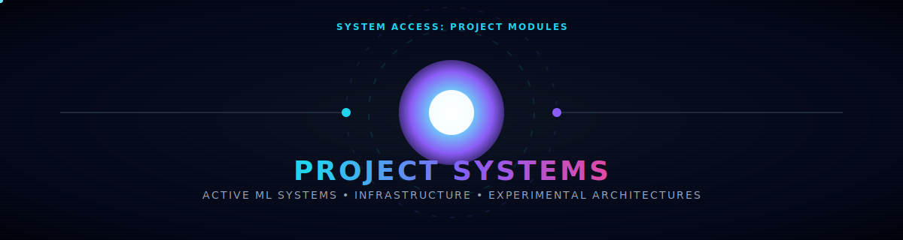
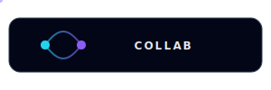

  

<table width="100%" border="0" cellspacing="0" cellpadding="0">
<tr>

<td width="16.66%" align="center">
  
</td>

<td width="16.66%" align="center">
  
</td>

<td width="16.66%" align="center">
  
</td>

<td width="16.66%" align="center">
  
</td>

<td width="16.66%" align="center">
  
</td>

<td width="16.66%" align="center">
  
</td>

</tr>
</table>

<h2 align="center">🧪 Project Systems</h2>

<table width="100%" cellspacing="20">
<tr>

<td width="50%" align="center">
  
    
  
    
  
</td>

<td width="50%" align="center">
  
    
  
    
  
</td>

</tr>
</table>