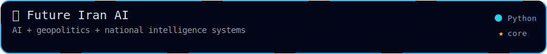
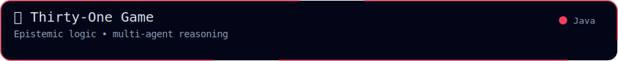
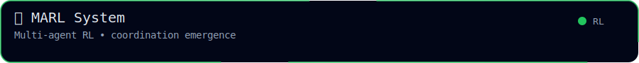
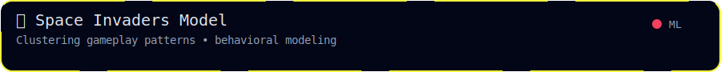

  

<table width="100%" border="0" cellspacing="0" cellpadding="0">
<tr>

<td align="center">
  
</td>

<td align="center">
  
</td>

<td align="center">
  
</td>

<td align="center">
  
</td>

<td align="center">
  
</td>

<td align="center">
  
</td>

</tr>
</table>

<h2 align="center">🧪 Project Systems</h2>

<!-- Row 1 -->

  
  

<!-- Row 2 -->

  
  

<!-- Row 3 -->

  
  

