  

  
  
  

  
  
  

---

  

  <a href="https://hirademami.github.io/neural-lab/index.html"><b>Neural Lab</b></a> ·
  <a href="https://hirademami.github.io/molecules/index.html"><b>Molecule Lab</b></a> ·
  <a href="https://hirademami.github.io/model-forge/index.html"><b>Model Forge</b></a>

## Lab Mission

  

## Related Pages

- [AI Domains](./AI_DOMAIN.md)
- [Projects](./PROJECTS.md)
- [Collaboration](./COLLAB.md)
- [Main Website](https://hirademami.github.io/)
